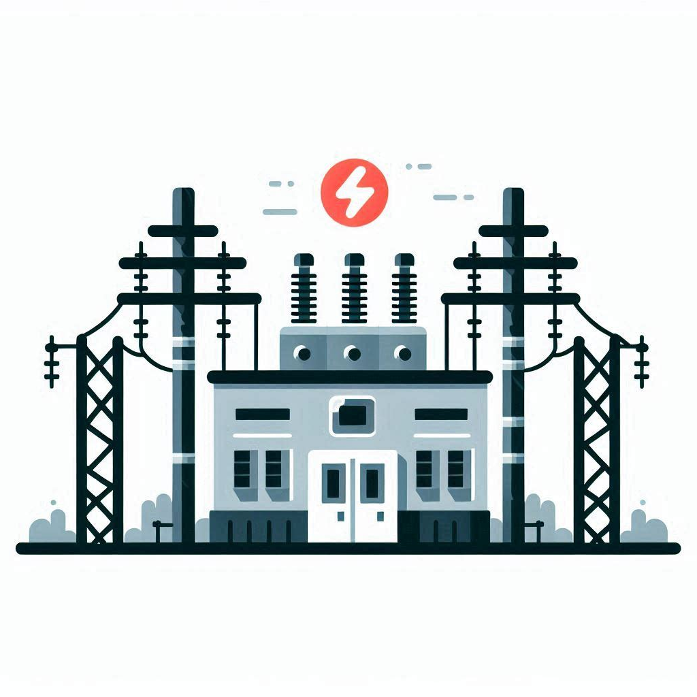

# Ayush Shrestha's Analytics Portfolio

## A Journey from Software Engineering to Analytics

Hello, I'm Ayush Shrestha!

Welcome to my personal portfolio, featuring key personal and academic projects as I transition from software engineering to the dynamic field of analytics and data science.

I hold a Master of Science in Business Analytics from the University of Washington, where I developed expertise in data science methodologies. Through hands-on projects, I gained proficiency in supervised, unsupervised, and deep learning algorithms using Python and R, as well as data visualization tools like Tableau, Power BI, and various Python libraries. Additionally, I have presented data-driven business insights to technical and non-technical stakeholders, including data scientists, analysts, and product managers. Leveraging these skills, I look forward to solving complex business challenges through data analysis.

I also hold a Bachelor of Commerce in Business and Computer Science from the University of British Columbia, where I built a solid foundation in data structures, algorithms, database management, and object-oriented programming. With over two years of experience in software engineering, I bring strong competencies in code development, testing, and optimization - skills that I am confident will enhance my effectiveness as an analyst and data scientist.

Feel free to connect with me on [LinkedIn](https://www.linkedin.com/in/ayush-yoshi-shrestha/)!

## Projects

1. [Predicting Electricity Load using Deep Learning - In Progress](#1-predicting-electricity-load-using-deep-learning---in-progress)
2. [Optimizing a Winery’s Marketing Communications Strategy](#2-optimizing-a-winerys-marketing-communications-strategy)
3. [Increasing Revenue for Global Movie Rentals](#3-increasing-revenue-for-global-movie-rentals)
4. [Enhancing Salesforce’s Customer Engagement - Capstone Project](#4-enhancing-salesforces-customer-engagement---capstone-project)
5. [Improving Customer Retention for Netflix](#5-improving-customer-retention-for-netflix)

### 1. Predicting Electricity Load using Deep Learning - In Progress

**Link to Full Project Report**: [NYC RNN](https://github.com/hobbeskocha/nyc-rnn)

**Goal**:
Forecast future load demand to optimize supply-side management.

**Description**:
In this ongoing project, I am developing a recurrent neural network (RNN) model to predict electricity load for New York City for 2024 using historical load and temperature data from 2021 to 2023. The project involves preprocessing and analyzing hourly data ranging from June 2021 to September 2023 as the training set, including handling missing values and normalizing the data. I am employing Long Short-Term Memory (LSTM) networks to capture temporal dependencies and achieve accurate predictions.

**Current Status**:
The data processing, model training, and model evaluation are complete. The network model has been fully defined, with a training loop implemented to optimize the weights and an inference loop to calculate the test error.

**Initial Findings**:
The model achieved an RMSE of 124 MW on the test set, relative to an interquartile range of 4900 to 6600 MW. The model also forecasts the highest demand of 7239 MW in July, with a peak hourly demand of 6378 MW occurring at 6 p.m. EST. These results suggest that NYC utilities should prioritize grid reinforcement to accommodate higher electricity demand, especially during summer evenings when usage typically spikes. Furthermore, allocating additional resources during peak periods could help prevent blackouts or system overloads, ensuring grid stability.

**Next Steps**:
Compare the LSTM model to more traditional time-series forecasting models, like SARIMA, to assess the relative predictive power of the deep learning approach.

**Tech Stack**:
Python (Pandas, PyTorch, Matplotlib, Seaborn)

### 2. Optimizing a Winery’s Marketing Communications Strategy

**Link to Full Project Report**: [Winery and You](https://github.com/hobbeskocha/winery-and-you)

**Goal**:
Develop predictive models that identify the key factors driving customer subscription preferences across three marketing channels: email, newsletter, and direct calls.

**Description**:
In this project, we analyzed a winery's sales data of over 65,000 records from across the United States. We performed data cleaning and feature transformation on the dataset, followed by exploratory data analysis in Tableau. Logistic regression and random forest models were then trained to predict customer preferences. The coefficients and feature importances were examined to pinpoint the critical attributes influencing the likelihood of subscription.

**Results**:
The models revealed strong performance for email and direct call predictions, with accuracies above 85%, along with significant cross-channel marketing effects. Key recommendations included enhancing cross-channel promotions by increasing call engagement and expanding email marketing campaigns to boost customer loyalty and marketing ROI for the winery.

**Tech Stack**:
Python (Pandas, Scikit-learn, Statsmodels, Matplotlib, Seaborn), Tableau

### 3. Increasing Revenue for Global Movie Rentals

**Link to Full Project Report**: [SQL for Sakila](https://github.com/hobbeskocha/sql-for-sakila)

**Goal**:
Uncover novel insights into key revenue drivers, rental patterns, and customer behaviour.

**Description**:
This project analyzes the Sakila database, a normalized relational databse consisting of 15 tables and over 40,000 records from a global movie rental company. We conducted data processing and exploratory data analysis primarily using PostgreSQL. The core analysis was leveraged PostgreSQL and Power BI to create data visualizations and dashboards that highlighted the impact of factors like genre, MPAA rating, and geographic region on revenue, rental volume, and customer behaviour.

**Results**:
Key findings include identifying PG-13 and NC-17 movies contribute approximately 50% of both revenue and rental volume, a negative correlation between movie length and the average days a movie is returned late, and that Store 1 experiences 20% more rentals despite having 10% less inventory than Store 2.
Recommendations include focusing marketing and acquisition efforts on PG-13 and NC-17 movies to maximize their revenue potential, implementing a timely-returns incentive program to reduce late returns, and introducing a dynamic inventory-sharing system between stores to address inventory bottlenecks.

**Tech Stack**:
SQL (PostgreSQL), Power BI

### 4. Enhancing Salesforce’s Customer Engagement - Capstone Project

**Note**:
Due to the nature of this consulting engagement with Salesforce, I am under an NDA and cannot share the full project report.

**Goal**:
Identify the key performance indicators driving high levels of customer engagement.

**Description**:
During a 10-week consulting engagement with Salesforce's Data & Analytics team as part of the Master of Science in Business Analytics program at the University of Washington, our team of 8 conducted exploratory data analysis on over 1 million customer engagement records spanning 14 months. Using Pandas, Tableau, and Excel, customers were segmented into high, medium, and low engagement groups, and the top 5 out of 24 metrics driving engagement were identified. Additionally, trend analysis in Tableau tracked changes in engagement levels across these segments.

**Results**:
I lead the 8-person team to present our findings and business strategies in-person to 7 senior data scientists and analysts, contributing to future engagement-enhancing campaigns at Salesforce. Recommendations included targeted "engagement nudges" for each segment and revised cutoff points for engagement thresholds.

**Tech Stack**:
Python (Pandas, NumPy, Matplotlib, Plotly Express), Tableau, Excel

### 5. Improving Customer Retention for Netflix

**Link to Full Project Report**: [Netflix Retention](https://github.com/hobbeskocha/netflix-retention)

**Goal**:
Identify the customer segments with a higher risk of churn to improve overall retention.

**Description**:
This project analyzes a synthetic dataset of approximately 2,500 customers to assist Netflix in refining its customer retention strategies. After performing data cleaning and exploratory data analysis using MySQL, key retention trends were visualized in Power BI, revealing the impact of customer tenure, preferred device type, age, and geography.

**Results**:
The analysis identified North American customers aged 41-50, who exhibited a 5% lower retention rate compared to their peers, as a high-risk segment prone to churn. To address the retention gap, recommendations included enhancing the user experience for family viewing and curating nostalgia-driven "must-watch" playlists for this demographic. By leveraging these insights, Netflix can more effectively tailor its marketing, content, and platform features to increase engagement and reduce churn in this critical customer segment.

**Tech Stack**: SQL (MySQL), Power BI

## Education

University of Washington - Foster School of Business

Master of Science in Business Analytics, June 2024

University of British Columbia - Sauder School of Business

Bachelor of Commerce with a Combined Major in Business and Computer Science, May 2022

## Certifications

[Microsoft Certified: Azure AI Fundamentals](https://learn.microsoft.com/api/credentials/share/en-us/ayushres-8993/72FFBA6B68CC6CD1?sharingId), August 2024

## Contact Info

[LinkedIn](https://www.linkedin.com/in/ayush-yoshi-shrestha/)
